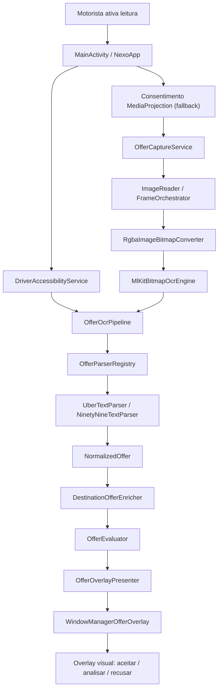
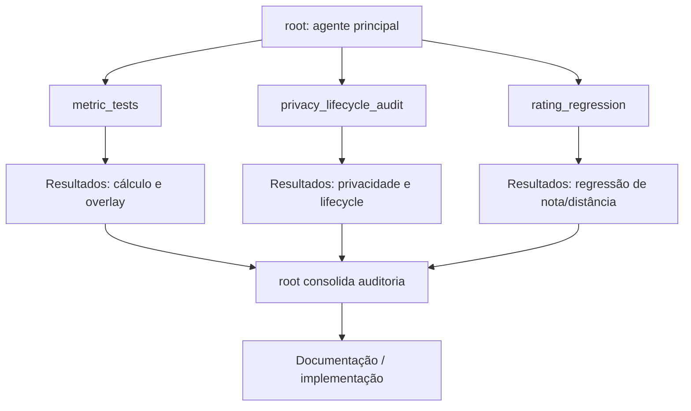

# Architecture Review - Driver Inteligente

## Resumo executivo

O Driver Inteligente é um aplicativo Android de módulo único (`:app`) para motoristas Uber/99. Ele lê ofertas visíveis na tela por OCR local, normaliza os campos relevantes da corrida, calcula métricas de decisão e exibe um overlay não interativo com o diagnóstico da oferta.

O pipeline é local e privado: `AccessibilityService` somente-leitura é a fonte principal, enquanto `MediaProjection` + `ML Kit Text Recognition` permanecem como fallback. Parsers pt-BR identificam cards Uber/99, regras configuradas pelo motorista avaliam a oferta e um overlay seguro apresenta o resultado sem tocar, aceitar ou recusar corridas.

## Arquitetura

### Fluxo runtime do app

1. `MainActivity` e `NexoApp` conduzem a UI Compose, permissões, perfis, filtros, destino e preferências.
2. `DriverAccessibilityService` observa somente texto exposto pelos apps Uber/99 e cria um `OcrTextSnapshot` de fonte `ACCESSIBILITY`.
3. Se a árvore não trouxer dados suficientes, `OfferCaptureService` inicia a sessão autorizada de `MediaProjection`.
4. `MediaProjectionFrameOrchestrator` recebe frames via `ImageReader`, aplica throttle/backpressure e converte RGBA para `Bitmap`.
5. `MlKitBitmapOcrEngine` executa OCR local com timeout próprio; ambos os caminhos convergem em `OfferOcrPipeline`.
6. `OfferOcrPipeline` ordena blocos, deduplica ofertas e chama `OfferParserRegistry` (Uber/99/99 Oferta).
7. `DestinationOfferEnricher` tenta enriquecer a oferta com direção ao destino usando pacote TSV offline selecionado pelo motorista.
8. `OfferEvaluator` calcula totais, R$/km, R$/h e aplica filtros.
9. `OfferOverlayPresenter` transforma a avaliação em modelo pronto para UI; `OfferDecisionSpeaker` fala a decisão uma vez por oferta.
10. `WindowManagerOfferOverlay` exibe o card em janela `TYPE_APPLICATION_OVERLAY`.



### Garantias de segurança e privacidade

- O manifest não declara `INTERNET`.
- `AccessibilityService` é usado somente para leitura de texto; não executa ações, gestos ou automação.
- O app não chama `performAction`, `dispatchGesture` nem simula toques em apps de terceiros.
- O overlay usa `FLAG_NOT_TOUCHABLE`, então não intercepta nem aciona controles da Uber/99.
- O overlay usa `FLAG_SECURE`, evitando que ele seja recapturado pelo próprio `MediaProjection`.
- Frames, árvore de acessibilidade e texto OCR bruto não são persistidos; o histórico opcional salva apenas resumo estruturado local.
- Diagnósticos de latência são agregados e locais.
- Backup/data extraction estão desabilitados para dados sensíveis.

## Árvore de diretórios

```text
.
├── .claude/
│   └── settings.json
├── app/
│   ├── build.gradle.kts
│   ├── proguard-rules.pro
│   └── src/
│       ├── androidTest/
│       │   └── java/br/com/nexo/driver/
│       │       ├── capture/
│       │       └── ocr/mlkit/
│       ├── main/
│       │   ├── AndroidManifest.xml
│       │   ├── java/br/com/nexo/driver/
│       │   │   ├── capture/
│       │   │   ├── destination/
│       │   │   ├── evaluation/
│       │   │   ├── ocr/
│       │   │   ├── offer/
│       │   │   ├── offline/
│       │   │   ├── overlay/
│       │   │   ├── parser/
│       │   │   ├── permission/
│       │   │   ├── profile/
│       │   │   └── ui/
│       │   └── res/
│       └── test/
│           └── java/br/com/nexo/driver/
├── docs/
│   ├── OFFLINE_ADDRESS_PACK.md
│   └── offline-address-pack-example.tsv
├── gradle/
│   ├── libs.versions.toml
│   └── wrapper/
├── build.gradle.kts
├── CLAUDE.md
├── gradle.properties
├── settings.gradle.kts
└── keystore.properties.example
```

### Responsabilidades por diretório

| Diretório | Responsabilidade |
| --- | --- |
| `capture/` | Serviço foreground, ciclo de vida do `MediaProjection`, captura de frames, throttle, sessão e diagnósticos de latência. |
| `ocr/` | Contrato de OCR local, pipeline de blocos OCR, deduplicação e implementação ML Kit. |
| `parser/` | Parsers pt-BR para layouts Uber, 99 padrão e 99 Negocia. |
| `offer/` | Modelos normalizados de oferta, dinheiro, distância, duração, passageiro e metadados. |
| `evaluation/` | Regras de filtro, cálculo de métricas derivadas e decisão `ACCEPT`, `ANALYZE` ou `REJECT`. |
| `overlay/` | Modelo visual, preferências de campos, presenter e janela overlay. |
| `destination/` | Destino do motorista, cálculo offline de direção e enriquecimento da oferta. |
| `offline/` | Registro local do pacote offline selecionado. |
| `profile/` | Perfis de filtro do motorista e persistência local. |
| `permission/` | Estado e prontidão de permissões necessárias por sessão. |
| `ui/` | Interface Compose: home, filtros, destino, permissões, settings e tema. |
| `docs/` | Documentação do pacote offline de endereços. |
| `.claude/` | Permissões e configuração local para uso no Claude Code. |

## Tecnologias utilizadas

| Tecnologia | Uso |
| --- | --- |
| Android Gradle Plugin `8.13.2` | Build Android. |
| Kotlin `2.2.10` | Linguagem principal. |
| Java 17 | Target/source compatibility. |
| Jetpack Compose + Material 3 | UI principal e overlay. |
| AndroidX Activity/Core/Lifecycle | Base Android e lifecycle. |
| ML Kit Text Recognition `16.0.1` | OCR local on-device. |
| JUnit 4 | Testes unitários. |
| AndroidX Test | Testes instrumentados. |
| SharedPreferences | Persistência local de perfis, destino, overlay e estado. |
| TSV local | Pacote offline de endereços para direção ao destino. |

Configuração Android atual:

- `namespace` / `applicationId`: `br.com.nexo.driver`
- `compileSdk`: `36`
- `targetSdk`: `36`
- `minSdk`: `29`
- `versionName`: `0.1.0`
- Release com R8/minify/shrink habilitados.
- Assinatura release opcional via `keystore.properties`, que fica fora do versionamento.

## Fluxo dos agentes

Os agentes descritos aqui pertencem ao fluxo de trabalho Codex usado para desenvolver e auditar o projeto. Eles não são componentes embarcados no APK, não rodam no Android e não fazem parte da arquitetura runtime do aplicativo.



| Agente | Responsabilidade |
| --- | --- |
| `root` | Agente principal. Coordena decisões, integra auditorias, executa mudanças finais e mantém coerência entre produto, código e testes. |
| `metric_tests` | Validou cálculos de R$/km, R$/h, totais, nota, proteção contra divisão por zero e valores/status exibidos no overlay. |
| `privacy_lifecycle_audit` | Auditou privacidade, lifecycle do `MediaProjection`, ausência de rede, ausência de automação e limpeza de recursos. |
| `rating_regression` | Criou regressão para impedir que distância de rota, como `1,6 km`, seja confundida com avaliação do passageiro. |

## Pontos fortes

- Arquitetura modular por responsabilidade, mesmo dentro de um módulo Android único.
- OCR, parsing, avaliação e direção ao destino são locais.
- O app preserva a regra essencial de não automatizar aceite/recusa.
- Overlay é seguro para uso sobre apps de terceiros por ser não tocável e protegido contra recaptura.
- Pipeline possui deduplicação de ofertas, backpressure de frame e timeout de OCR.
- Existem diagnósticos agregados para p95, máximo e violações da meta de 1 segundo.
- Testes unitários cobrem parser, evaluator, destino offline, preferências, permissões, latência, throttle e modelos.
- Cinco fixtures visuais reais cobrem Uber claro/escuro, 99 padrão e 99 Negocia de OCR até métricas e overlay.
- Separação clara entre modelo normalizado (`NormalizedOffer`), regras (`FilterRule`) e apresentação (`OfferOverlayUiModel`).
- O pacote offline de endereços tem formato documentado e limite de tamanho para proteger o serviço foreground.

## Gargalos e riscos

- O parser depende de OCR + regex/texto pt-BR; mudanças visuais ou textuais da Uber/99 podem quebrar extrações.
- O ML Kit domina a maior parte do orçamento de latência, especialmente em cold start.
- A captura em resolução menor melhoraria pouco a latência e pode prejudicar leitura de texto pequeno, principalmente na 99.
- Testes instrumentados ainda cobrem pouco do fluxo visual real: overlay, revogação do `MediaProjection` e cards reais em tela.
- A detecção de "em direção ao destino" depende de endereços resolvidos por pacote TSV local, não de um mapa offline visual completo.
- A assinatura release local está documentada; publicação em loja ainda exige checklist e gestão externa da chave.
- O uso de `HandlerThread`/`Executor` é funcional, mas pode ficar mais difícil de manter se o pipeline crescer.

## Oportunidades de melhoria

- Expandir as fixtures versionadas sempre que Uber/99 alterarem layout ou apresentarem uma nova modalidade.
- Adicionar benchmark automatizado por família de layout, registrando p50, p95, máximo e taxa de parse.
- Expandir testes instrumentados para overlay real, revogação de captura, rotação e lifecycle do serviço.
- Melhorar observabilidade local sem dados sensíveis, com painel interno de latência e contadores de layout não reconhecido.
- Criar ferramenta guiada para importar, validar e pré-visualizar o pacote offline de endereços.
- Documentar checklist de release assinado, incluindo geração de keystore local, `keystore.properties` e validação do APK final.
- Avaliar migração gradual para coroutines apenas se ela reduzir complexidade real de cancelamento, timeout e lifecycle.
- Adicionar uma matriz de compatibilidade para versões de Android e dispositivos testados.
- Criar política de atualização de parsers quando Uber/99 alterarem layout, com captura de fixture, teste e validação em aparelho.

## Consumo esperado de contexto/tokens

| Tipo de trabalho | Consumo esperado |
| --- | --- |
| Auditoria/documentação simples | 4k-12k tokens |
| Correção localizada com testes | 20k-60k tokens |
| Mudança transversal em OCR/parser/overlay | 80k-180k tokens |
| Validação em dispositivo com iteração visual | 40k-120k tokens |
| Ciclo grande com múltiplos agentes e Meta ativa | 200k-500k tokens |

Esses valores são estimativas operacionais para planejar uso de contexto. O consumo real cresce quando há screenshots novos, testes em aparelho físico, builds repetidos, análise de logs e coordenação simultânea entre agentes.

## Validação

Validações recomendadas para qualquer mudança relevante:

```powershell
.\gradlew.bat testDebugUnitTest
.\gradlew.bat lintDebug
.\gradlew.bat assembleRelease
```

Última validação conhecida do projeto:

- Testes unitários e build passaram em ciclos anteriores.
- `assembleRelease` gera APK não assinado quando `keystore.properties` não existe.
- Medições reais recentes em dispositivo ficaram abaixo de 1 segundo no caminho captura até overlay.
- O dry-run de `testDebugUnitTest` foi verificado durante esta auditoria e confirmou o caminho principal de testes.

## Assumptions

- Este documento descreve o estado arquitetural atual e não altera código.
- "Agentes" significa agentes Codex usados no desenvolvimento, não serviços Android.
- "Meta" é tratada como mecanismo de coordenação e acompanhamento do trabalho, não como dependência runtime do app.
- O projeto continua com prioridade de privacidade local, ausência de rede e ausência de automação de aceite/recusa.
- O pacote offline de endereços é a base atual para direção ao destino; downloader completo de mapas offline é evolução futura.
